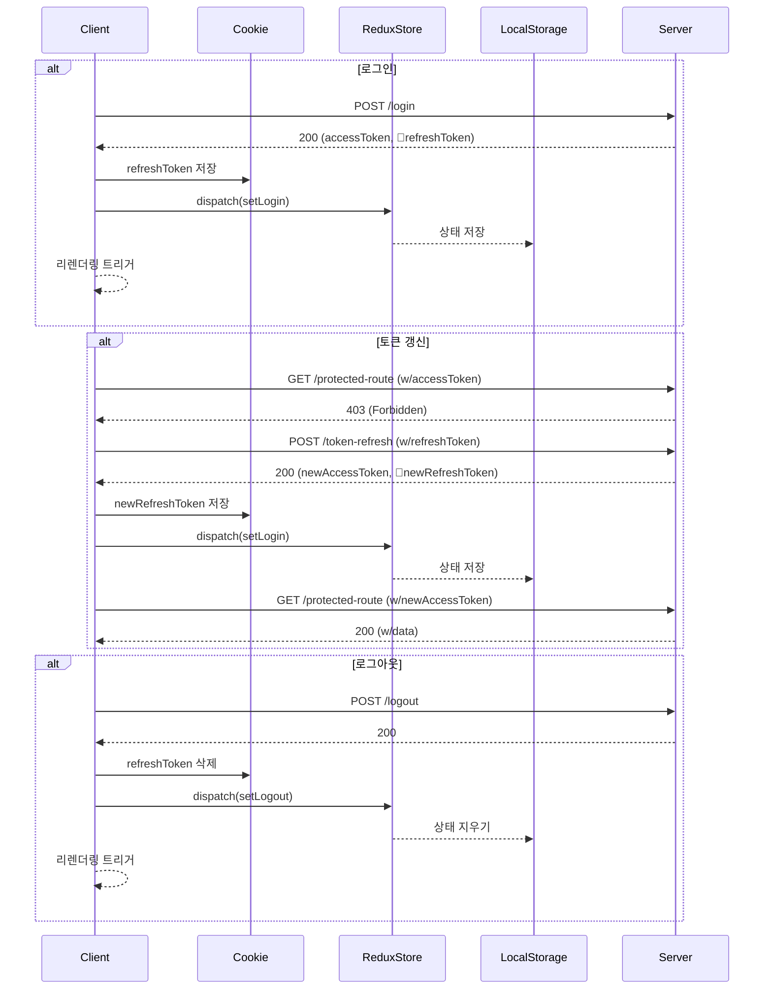
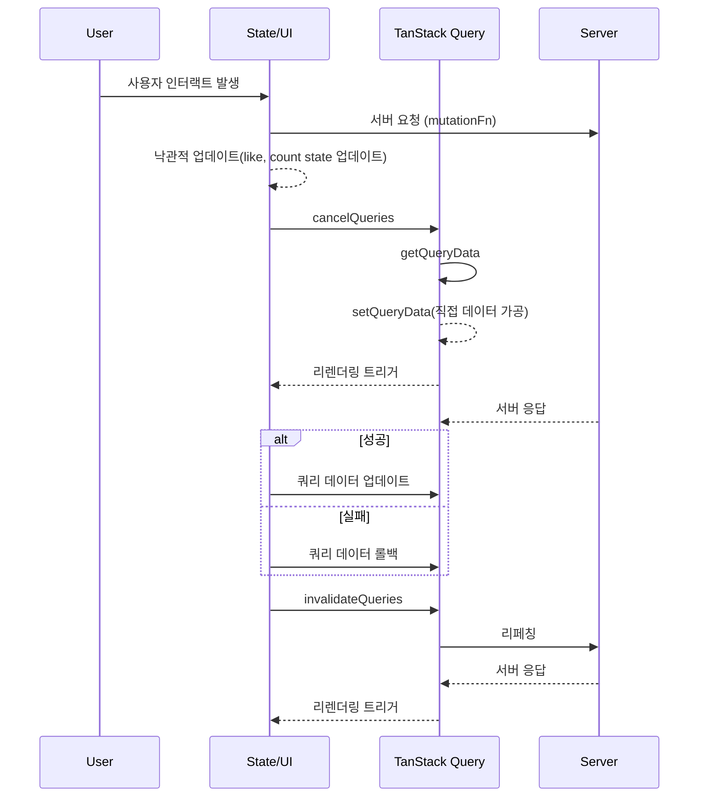

<div align="center">

  
  <h1>diskettte-exclusive</h1>

**URL**: http://diskettte-exclusive.my.to

**👤게스트 계정**: `guest`/`qwerty!1`

</div>

## 1. 개요

*diskettte-exclusive*은 가상의 쇼핑몰 [diskettte](https://github.com/itso-wavy/diskettte) 유저를 대상으로 하는 소셜 네트워크 서비스입니다.
TypeScript+MERN 스택 기반으로 모던 웹 기술을 적용하여 사용자 경험과 성능을 최적화했습니다. 사용자 인증, 포스트와 댓글 관리, 팔로우 시스템 등 SNS의 핵심 기능을 포함하고 있습니다. [threads](https://www.threads.net)의 비즈니스 로직을 참고했습니다.

## 2. 기술 스택


### (1) Common

- 언어: [TypeScript](https://www.typescriptlang.org/)
- 린팅 & 포맷팅: [ESLint](https://eslint.org/), [Prettier](https://prettier.io/)
- 유효성 검사: [Zod](https://zod.dev/)

### (2) Client

- 라이브러리: [React](https://ko.legacy.reactjs.org/) v.18
- 라우팅: [React Router](https://reactrouter.com/) v.6
- HTTP 클라이언트: [Axios](https://axios-http.com/)
- 클라이언트 전역 상태 관리: [Redux Toolkit](https://redux-toolkit.js.org/) v.2, [Redux Persist](https://github.com/rt2zz/redux-persist#readme)
- 서버 상태 관리: [TanStack Query](https://tanstack.com/query/latest) v.5
- 폼 상태 관리: [React Hook Form](https://react-hook-form.com/)
- 스타일링: [Tailwind CSS](https://tailwindcss.com/) v.3
- UI 컴포넌트: [shadcn/ui](https://ui.shadcn.com/)
- CSS 도구: [PostCSS](https://postcss.org/), [Autoprefixer](https://www.npmjs.com/package/autoprefixer)
- SVG 처리: [SVGR](https://react-svgr.com/)

### (3) Server

- 런타임: [Node.js](https://nodejs.org/)
- 프레임워크: [Express](https://expressjs.com/)
- 데이터베이스: [MongoDB](https://www.mongodb.com/ko-kr)(ODM [Mongoose](https://mongoosejs.com/))
- 인증: [JWT](https://jwt.io/)

### (4) Deployment

- 클라우드 인스턴스: [Amazon EC2](https://aws.amazon.com/ko/ec2/?gclid=CjwKCAjw-O6zBhASEiwAOHeGxVUD__lm6qh_odGit5oDKibJ-eElc2X-tMEDhH-7TahietD5Wx5AcRoCeZIQAvD_BwE&trk=bc3c5de1-7376-43c7-ad4f-f0f3f8248023&sc_channel=ps&ef_id=CjwKCAjw-O6zBhASEiwAOHeGxVUD__lm6qh_odGit5oDKibJ-eElc2X-tMEDhH-7TahietD5Wx5AcRoCeZIQAvD_BwE:G:s&s_kwcid=AL!4422!3!588924203019!e!!g!!aws%20ec2!16390049454!133992834459)
- 프론트엔드용 웹 서버: [nginx](https://nginx.org/)
- 데이터베이스 호스팅: [MongoDB Atlas](https://www.mongodb.com/products/platform/atlas-database)

## 3. 특징

1.  **TypeScript 기반 풀스택 아키텍처**
    

    - 서버와 클라이언트 모두에 TypeScript를 사용하여 정적 타입 검사를 통한 코드 안정성 확보
    - ESLint, Prettier와 코딩 컨벤션으로 코드 품질과 가독성 유지

2.  **모던 프론트엔드 기술 사용**

    - React와 React Router를 이용한 SPA 구현, CSR 적용
    - Redux Toolkit과 Redux Persist를 통한 중앙 집중식 상태 관리 및 지속성 보장
    - TanStack Query를 활용해 효율적인 서버 상태 관리 및 캐싱과 낙관적 UI 업데이트 구현

3.  **보안 및 인증 시스템**

    - JWT 기반의 접근 토큰 및 갱신 토큰 인증 메커니즘 적용
    - CORS 설정을 통한 리소스 접근 제어
    - HttpOnly, SameSite 쿠키 설정으로 XSS 및 CSRF 공격 방지
    - Argon2 암호화 알고리즘으로 비밀번호 해싱

4.  **UX 중심의 스타일링 및 테마 시스템**

    - Tailwind CSS와 shadcn/ui로 일관성, 확장성 및 접근성을 충족하는 디자인 시스템 구축
    - 라이트/다크 모드와 6가지 컬러 테마를 포함한 개인 테마 설정 기능
    - SVG 동적 스타일링으로 인터랙티브한 UX 구현 및 에셋 최적화

5.  **폼 핸들링 및 유효성 검사 강화**:

    - React Hook Form으로 선언적 폼 상태 관리 및 UI 렌더링
    - Zod 스키마 기반의 정교한 유효성 검사와 에러 메시지 피드백

6.  **체계적인 아키텍처 설계**

    - 기능별 폴더 구조와 단일 책임 원칙에 기반한 컴포넌트 모듈화로 코드 유지보수성 및 확장성 향상
    - form, post, comment 등 복합적 UI에 Compound Components 패턴 사용(클라이언트)
    - 라우트별 컨트롤러를 미들웨어 체이닝으로 구현해 유연한 요청 처리(서버)
    - 중앙화된 응답/에러 핸들링 미들웨어로 일관된 API 응답/에러 처리(서버)

7.  **성능 최적화 및 사용자 경험 향상**
    - 메모이제이션 기법(useMemo, useCallback)을 활용한 리렌더링 방지
    - 낙관적 업데이트를 통한 빠른 반응성 구현

## 4. 주요 기능

<!-- 🐬🦈🐬 영상 추가 예정 -->

1.  **유저 인증 및 권한 부여**:

    - 회원가입, 로그인, 로그아웃
    - 토큰 갱신 메커니즘을 통한 인증 보안
    - 인증/인가 상태에 따른 라우트 보호와 조건부 렌더링
    - 비밀번호 암호화 저장

1.  **유저 프로필**:

    - 유저 프로필 조회, 수정

1.  **개인 테마화**:

    - 라이트/다크 모드, 6색 컬러 개인 테마화

1.  **포스트 관리**:

    - 포스트 작성, 조회, 수정, 삭제
    - 포스트당 최대 3개의 이미지 업로드 지원
    - 로그인한 유저 포스트를 제외한 전체 포스트 모아보기
    - 특정 유저 포스트 모아보기
    - 단일 포스트 상세 보기

1.  **댓글 시스템**:

    - 포스트 댓글 작성, 조회, 수정, 삭제

1.  **좋아요 시스템**:

    - 포스트 좋아요 추가/제거

1.  **북마크 시스템**:

    - 포스트 북마크 추가/제거
    - 북마크한 포스트 모아보기

1.  **팔로우 시스템**:

    - 다른 유저 팔로우/언팔로우
    - 팔로우한 유저 포스트 모아보기

1.  **검색 기능**:

    - 유저 아이디, 닉네임 검색

1.  **기타**:

    - 에러 페이지와 리페치 컴포넌트
    - 로딩 스켈레톤 및 인디케이터
    - 반응형 디자인과 다양한 UI 컴포넌트

## 5. 폴더 구조

```shell
├─💾server
│  └─src
│     │  index.ts
│     │
│     ├─🎫controllers
│     │      authController.ts
│     │      bookmarkController.ts
│     │      commentController.ts
│     │      followController.ts
│     │      likeController.ts
│     │      postController.ts
│     │      profileController.ts
│     │      searchController.ts
│     │
│     ├─🎫db
│     │  index.ts
│     │
│     ├─🎫lib
│     │ │  types.ts
│     │ │
│     │ └─🏷️utils
│     │      token-utils.ts
│     │
│     ├─🎫middlewares
│     │      authentication.ts
│     │      response-handler.ts
│     │
│     ├─🎫models
│     │      BookmarkModel.ts
│     │      CommentModel.ts
│     │      FollowModel.ts
│     │      index.ts
│     │      LikeModel.ts
│     │      PostModel.ts
│     │      UserModel.ts
│     │
│     ├─🎫routers
│     │      index.ts
│     │      postRoutes.ts
│     │      userRoutes.ts
│     │
│     └─🎫schemas
│            auth-schema.ts
│            imageFileValidator.ts
│            post-schema.ts
│            profile-schema.ts
│
└─💾client
   │  index.html
   │
   ├─🎫public
   │  favicon.png
   │  logo-dark.png
   │  logo.png
   │
   ├─🎫src
   │  App.tsx
   │  main.tsx
   │
   ├─🎫components
   │  │  ErrorText.tsx
   │  │  Loader.tsx
   │  │  ProfileAvatar.tsx
   │  │  Skeleton.tsx
   │  │
   │  ├─🏷️comment
   │  │      CommentMoreButton.tsx
   │  │      index.ts
   │  │      PostComment.tsx
   │  │
   │  ├─🏷️dialog
   │  │      CommentForm.tsx
   │  │      index.ts
   │  │      LoginForm.tsx
   │  │      PostForm.tsx
   │  │      RegisterForm.tsx
   │  │      types.ts
   │  │
   │  ├─🏷️form
   │  │      Button.tsx
   │  │      Form.tsx
   │  │      IconButtons.tsx
   │  │      index.ts
   │  │      ProfileForm.tsx
   │  │
   │  ├─🏷️icons(svg 파일 목록 생략)
   │  │
   │  ├─🏷️layout
   │  │      DialogLayout.tsx
   │  │      index.ts
   │  │      PageWrapper.tsx
   │  │      WidthWrapper.tsx
   │  │
   │  ├─🏷️post
   │  │      FeedPost.tsx
   │  │      index.ts
   │  │      Post.tsx
   │  │      PostBookmarkButton.tsx
   │  │      PostCommentButton.tsx
   │  │      PostLikeButton.tsx
   │  │      PostMoreButton.tsx
   │  │      PostSkeleton.tsx
   │  │
   │  └─🏷️ui
   │         avatar.tsx
   │         dialog.tsx
   │         dropdown-menu.tsx
   │         scroll-area.tsx
   │         sonner.tsx
   │         switch.tsx
   │         tooltip.tsx
   │
   ├─🎫context
   │      commentContext.tsx
   │      followContext.tsx
   │      postContext.tsx
   │      themeContext.tsx
   │
   ├─🎫lib
   │  ├─🏷️assets
   │  │      errorball.svg
   │  │      wave.svg
   │  │
   │  ├─🏷️queries
   │  │      post-interaction.ts
   │  │      post.ts
   │  │      profile.ts
   │  │
   │  ├─🏷️schemas
   │  │      imageFileValidator.ts
   │  │      index.ts
   │  │      postValidator.ts
   │  │      profileValidators.ts
   │  │      userValidators.ts
   │  │
   │  ├─🏷️services
   │  │      auth.ts
   │  │      index.ts
   │  │
   │  ├─🏷️store
   │  │  │   index.ts
   │  │  │   store.ts
   │  │  │
   │  │  └─📦features
   │  │        authSlice.ts
   │  │        themeSlice.ts
   │  │        userSlice.ts
   │  │
   │  ├─🏷️types
   │  │      index.ts
   │  │      post.ts
   │  │      theme.ts
   │  │      user.ts
   │  │
   │  └─🏷️utils
   │         cn.ts
   │         date.ts
   │         debounce.ts
   │         file.ts
   │         index.ts
   │
   ├─🎫pages
   │  │  index.ts
   │  │
   │  ├─🏷️Bookmarks
   │  │  │  index.tsx
   │  │  │
   │  │  └─📦components
   │  │       index.ts
   │  │       PostList.tsx
   │  │
   │  ├─🏷️Error
   │  │     index.tsx
   │  │
   │  ├─🏷️Feed
   │  │  │  index.tsx
   │  │  │
   │  │  └─📦components
   │  │       FeedNav.tsx
   │  │       index.ts
   │  │       PostList.tsx
   │  │
   │  ├─🏷️PostDetail
   │  │  │  index.tsx
   │  │  │
   │  │  └─📦components
   │  │       index.ts
   │  │       PostWithComments.tsx
   │  │
   │  ├─🏷️Profile
   │  │     index.tsx
   │  │
   │  ├─🏷️RootLayout
   │  │  │  index.tsx
   │  │  │
   │  │  └─📦components
   │  │       Header.tsx
   │  │       index.ts
   │  │       MainNav.tsx
   │  │       NavLinkButton.tsx
   │  │       NavMenuBlock.tsx
   │  │
   │  ├─🏷️Search
   │  │  │  index.tsx
   │  │  │
   │  │  └─📦components
   │  │       index.ts
   │  │       SearchInput.tsx
   │  │       SearchList.tsx
   │  │
   │  ├─🏷️UserLayout
   │  │     index.tsx
   │  │
   │  └─🏷️UserPage
   │     │  index.tsx
   │     │
   │     └─📦components
   │          FollowButton.tsx
   │          index.ts
   │          PostListField.tsx
   │          ProfileCard.tsx
   │          ProfileField.tsx
   │          ProfileSkeleton.tsx
   │
   ├─🎫routes
   │     index.tsx
   │
   └─🎫styles
         index.css
```

## 6. 트러블슈팅

### (1) JWT 기반 이중 토큰 인증 메커니즘 적용



### (2) 󠀠TanStack Query 쿼리 무효화와 쿼리 직접 수정을 통한 낙관적 UI 업데이트 구현

- **문제**: React state로만 서버 상태 처리시,
  1. 서버 데이터와 UI 업데이트 간 동기화 지연
  2. 여러 데이터 요청(쿼리)에 동일 데이터가 포함되어 있을 때 데이터 간 불일치
  3. 2번 문제의 해결책으로 단일 쿼리가 아닌 전체 데이터 리페치시 성능 저하 발생
- **해결**: 󠀠TanStack Query의 데이터 캐싱 기능으로,
  1. 사용자 인터랙션 시 낙관적 업데이트 로직을 통해 서버 응답을 기다리지 않고 즉시 UI 업데이트
  2. 데이터 요청 성공 시 응답값으로 캐싱 데이터 업데이트, 실패 시 이전 상태로 롤백하여 안정적인 에러 처리
  3. QueryClient 로 특정 쿼리키만 수동으로 업데이트/쿼리 무효화/백그라운드 캐시 갱신. 필요한 데이터만 리페치하여 성능 최적화
- **결과**
  1. 서버 데이터 응답과 리렌더링 대기 없이 즉각적인 UI 반응으로 UX 향상
  2. 동기화된 데이터로 여러 페이지 간 일관된 UI 제공
  3. 불필요한 서버 요청 감소로 성능 향상



### (3) 󠀠󠀠Vite 개발 환경에서 SVG 동적 스타일링과 플러그인으로 SVG 최적화(77.8% 용량 감소)

- **문제**: SVG 아이콘이 다양한 모드(라이트/다크)와 테마(6색 컬러)로 인해 배리에이션이 많아져 최적화가 필요함
- **해결**: SVG를 Vite 플러그인으로 React 컴포넌트화하고, CSS 변수와 조건부 렌더링으로 동적 스타일링
  1.  vite-plugin-svgr 플러그인으로 SVG 파일을 React 컴포넌트화, @svgr/plugin-svgo , @svgr/plugin-jsx 플러그인으로 최적화 및 JSX 문법 지원
  2.  SVG 파일 내 색상을 특정 문자열로 표기하고, vite-plugin-svgr 플러그인으로 문자열 > CSS 변수 치환
  3.  테마 색상을 CSS 변수로 정의하고, 이를 다시 --svg-fill 등의 변수에 담아 조건부 렌더링으로 SVG 컴포넌트 클래스에 동적 적용
  4.  Tailwind CSS의 JIT 기능으로 CSS 변수들이 빌드 시 제외되지 않도록 config 파일에 변수 등록
- **결과**: 에셋 파일 수를 72개 → 19개로 줄이고, 파일 크기를 77.8%(41.1KB → 9.13KB) 최적화함 󠀠

### (4) 서버 코드 최적화로 데이터 요청 성능 향상(92.7% 단축)

- **문제**: 데이터 모수가 늘어날수록 요청 처리에 긴 시간이 소요됨(최후 측정 42.49s, 최대 1.5m)
- **해결**
  1.  `find()` 후 `lean()` 메서드로 MongoDB 객체를 가벼운 JavaScript 객체로 변환(42.49s → 39.8s)
  2.  자주 상호작용하는 2개의 DB를 통합해 성능 향상(39.8s → 2.16s)
  3.  비동기 작업 대신 `populate` 사용으로 컬렉션 탐색 최적화(2.16s → 931.34ms)
  4.  주요 필드에 인덱스 추가로 쿼리 성능 향상(최종 테스트 환경에서 3.11s)
- **결과**: 데이터 요청 처리 시간을 42.5초에서 3.11초로 92.7%(42.5s → 3.11s) 단축함 󠀠
